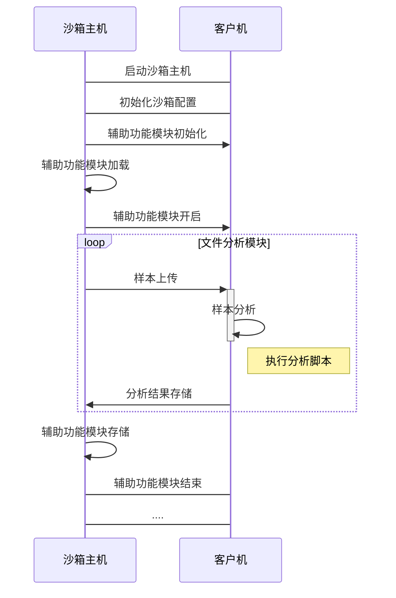
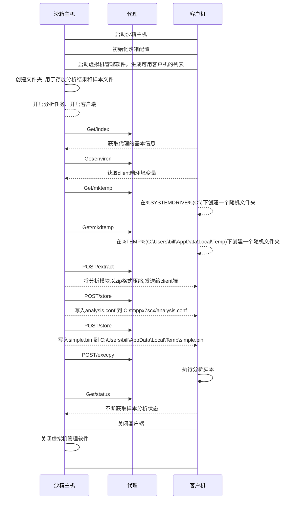

### ==一、背景介绍==

#### 1.1 恶意软件

#### 1.2 恶意软件造成的财富损失

#### 1.3 沙箱

#### 1.4 沙箱深度调研对比

##### 

### ==二、内容设计==

**格式的软件**、**采用哪些方法**、**采集哪些数据**、**哪些分析算法**、采用什么样的**设置**和**交互方式**

#### 2.1 核心组成部分

- 主机（一台）：系统的核心服务器端，运行着云沙箱的核心组件，负责恶意软件分析任务的启动和分析结果报告的生成，同时负责管理多个客户机。

- 客户机（若干）：多个独立的隔离环境（即多台虚拟机），负责提供虚拟环境供恶意软件样本运行，同时检测目标样本的运行情况，并将检测到的数据反馈给主机。

#### 2.2 系统架构图

主机和客户机之间通过虚拟网络连接，多个客户机与主机共同组成一个局域网


#### 2.3 系统部署环境

| 名称   |      |
| ------ | ---- |
| 主机   |      |
| 客户机 |      |
|        |      |
|        |      |

#### 2.4 CWD文件内容

加入训练模型models

```python
├── agent(agent.py agent.sh android)
├── analyzer(android, darwin, linux, windows)
├── conf ``-``-``> (cuckoo的配置文件)
├── distributed
├── elasticsearch
├── __init__.py
├── log(日志)
├── monitor(hook程序)
├── pidfiles(正在)
├── signatures(样本特征)
├── storage(存储样本程序,及分析的结果)
├── stuff
├── supervisord
├── supervisord.conf
├── web(web登录的一些设置)
├── whitelist
└── yara(样本分析的yara规则, 如:shellcode.yar, vmdetect.yar)
```

#### 2.5 功能列表

**2.5.1  文件对象**

**2.5.2  检测信息**

**2.5.3  检测方法**

**2.5.4  报告内容**

#### 2.6 沙箱运行流程


#### 
### 三、功能模块设计

#### 3.1 辅助功能模块

##### 3.1.1 设计说明

​		辅助模块定义了一些需要与每个**样本分析过程中进行并行执行的辅助功能**。为用户提供记录分析样本的网络流量、中间人代理、客户端重启等辅助功能。全部辅助模块放在 **../cuckoo/auxiliary/** 目录下，全部辅助模块配置选项在 ***.CWD/conf/auxiliary.conf*** 文件下。

**1）辅助功能定义函数**

```python
class MyAuxiliary(Auxiliary):
		"""定义辅助模块"""
		def start(self):
		# 定义辅助功能

		def stop(self):
		# 定义模块关闭
```

- start()：将在主机启动客户机并有效执行提交的恶意文件之前执行
- stop()：将在分析过程的最后以及启动处理和报告过程之前执行

**2）辅助功能运行函数**

```python
class RunAuxiliary(object):
    """辅助模块管理"""
	def __init__(self, task, machine, guest_manager)：
   	# 辅助功能模块初始化
    
  	def start(self):
    # 辅助功能模块配置
  		options = config2("auxiliary", module_name)
    def callback(self, name, *args, **kwargs):
    # 辅助功能模块加载
 		MyAuxiliary.start()	
  	def stop(self):
    # 辅助功能模块关闭
    	MyAuxiliary.stop()	
```

+  \__init\_\_(): 辅助功能模块初始化（任务号、虚拟机软件、客户机IP映射等）
+ start(): 根据 ***.CWD/conf/auxiliary.conf*** 下的配置选择辅助功能模块列表
+ callback(): 开启辅助功能模块列表的辅助功能
+ stop(): 关闭辅助功能模块列表的辅助功能

**3）辅助功能列表**

| 辅助模块名称 | 辅助模块功能                                          |
| ------------ | :---------------------------------------------------- |
| **sniffer**  | 负责执行tcpdump以转储沙箱样本分析过程中生成的网络流量 |
| **mitm**     | 负责执行mitmdump以提供中间人代理功能                  |
| **reboot**   | 负责提供重启分析支持                                  |

##### 3.1.2 设计流程

**1) 辅助功能模块时序图**



**2）辅助功能模块流程设计**

1. 启动沙箱主机
2. 初始化沙箱配置
3. 辅助功能模块初始化
4. 辅助功能模块加载
5. 辅助功能模块开启
6. 样本上传
7. 样本分析
8. 分析结果存储
9. 辅助功能模块存储
10. 辅助功能模块关闭

#### 3.2 机器交互模块

##### 3.2.1 设计说明

​		**定义了与虚拟化软件的交互过程**，**开启虚拟机、启动任务调度、上传样本、上传分析模块和分析配置文件、在数据库中记录虚拟机的状态等**。全部机器交互模块放在 **../cuckoo/mechinery/** 目录下，我们默认使用了VirtualBox虚拟机软件。全部辅助模块配置选项在 ***.CWD/conf/virualbox.conf*** 文件下。

​		**沙箱主机**与**客户机**网络配置中使用**Host-Only**连接方式，一个恶意软件被安装配置了cuckoo的host提交到各个guest进行运行分析时，host是想要知道guest的所有流量信息的，因为绝大部分的恶意软件搞破坏都依赖网络。此时只有设置Host-Only连接，host才能截获guest与互联网之间流经的所有流量，才能更好的分析恶意软件的行为方式。

**1）机器交互定义函数**

```python
class MyMachinery(Machinery):
 	def start(self, label):
 		# 开启定义虚拟机管理软件
	def initialize(self, module_name):
      	self._initialize(module_name)
        # 初始化配置信息
 	def stop(self, label):
 		# 关闭定义虚拟机管理软件
```

- start()：开启定义虚拟机管理软件
- stop()：关闭定义虚拟机管理软件
- initialize()：根据指定的配置信息（标签、平台、IP等）生成可用客户机的列表

**2）机器交互管理函数**

```python
class AnalysisManager(threading.Thread):

    def __init__(self, task_id, error_queue):
        # 读取任务的消息、配置文件中的服务端ip和端口

    def init(self):
        # 初始化分析, 创建分析结果存储目录

    def acquire_machine(self):
        # 开启配置虚拟机
        
    def launch_analysis(self):
  			# 开启分析任务
        self.init():
        self.acquire_machine()
        # 开启虚拟机如：machinery/virtualbox.py 中 VirtualBox.start
        machinery.start(self.machine.label, self.task)

        return succeeded
```

+ \__init\_\_(): 读取任务的消息(指明分析时间、系统类型、开始时间、结束时间、指明分析状态）；配置文件中的服务端ip和端口（我这里设置的是192.168.56.1和2042）
+ init()：创建文件夹, 用于存放分析结果和样本文件，将target指向的文件存放到storage/binaries下
+ acquire_machine(): 开启配置虚拟机
+ launch_analysis(): 开启分析任务，各个模块的清理工作

**3）客户端代理函数**

Host和Client端的数据传输,客户端代理 **agent.py** 脚本在客户机运行

```python
class MiniHTTPRequestHandler(SimpleHTTPServer.SimpleHTTPRequestHandler):
  	# 用作对不同路径的不同函数处理(响应)
    server_version = "Cuckoo Agent"

    def do_GET(self):
       # 响应GET请求

    def do_POST(self):
       # 响应POST请求
    	 # host与client之间的数据传输, 格式为multipart/form-data
```

+ do_GET(): 响应GET请求
+ do_POST():
  +  响应POST请求
  + host与client之间的数据传输, 格式为multipart/form-data.可以理解key:value形式
  + 如: analysis.conf, 分析模块, 样本等，这些数据在传输的时候, 都要带有filename字段

```python
AGENT_VERSION = "0.10"
AGENT_FEATURES = [
    "execpy", "pinning", "logs", "largefile", "unicodepath",
]
 
@app.route("/")
def get_index():
  
@app.route("/environ")
def get_environ():

@app.route("/mktemp", methods=["GET", "POST"])
def do_mktemp():
    
@app.route("/mkdtemp", methods=["GET", "POST"])
def do_mkdtemp():  
    
@app.route("/extract", methods=["POST"])
def do_extract():
    
@app.route("/store", methods=["POST"])
def do_store():
  
@app.route("/execpy", methods=["POST"])
def do_execpy():
       
@app.route("/status")
def get_status():
```

+ get_index(): agent的一些基本信息

  + 浏览器输入`192.168.56.2:8000` 返回：

    ```python
    {"message": "Cuckoo Agent!", "version": "0.10", "features": ["execpy", "pinning", "logs", "largefile", "unicodepath"]}
    ```

+ get_environ(): 获取client端环境变量,以便后面后续的一些命令执行

+ do_mktemp() 和 do_mkdtemp()

  + 两个创建临时文件夹的命令: mktemp和mkdtemp. 但二者创建的位置不一样
  + mkdtemp --> 在%SYSTEMDRIVE%(C:\)下创建一个随机文件夹
  + mktemp --> 在%TEMP%(C:\Users\bill\AppData\Local\Temp)下创建一个随机文件夹

+ do_extract(): 将分析模块以zip格式压缩,发送给client端. 发送extrac命令, 将分析模块解压到上一步创建的文件夹中.

+ do_store():

  + 执行store命令, 写入analysis.conf 到 C:/tmppx7scx/analysis.conf

  | analysis.conf | 内容                                                         |
  | ------------- | ------------------------------------------------------------ |
  | **category**  | file                                                         |
  | **target**    | /tmp/cuckoo-tmp-pwnmelife/tmpZ3SA0v/maze.exe (host端的样本地址) |
  | **package**   | exe                                                          |
  | **file_type** | PE32 executable (GUI) Intel 80386, for MS Windows            |
  | **file_name** | maze.exe                                                     |
  | **clock**     | 20200620T09:28:00                                            |
  | **id**        | 1                                                            |
  | **timeout**   | 120                                                          |
  | **ip**        | 192.168.56.1                                                 |
  | **port**      | 2042                                                         |

  + 执行store命令, 写入simple.bin 到 C:\Users\bill\AppData\Local\Temp\simple.bin

+ do_execpy(): 执行分析脚本

+ get_status(): 不断获取样本分析状态

**4）客户端管理函数**

```python
class GuestManager(object):

    def __init__(self, vmid, ipaddr, platform, task_id, analysis_manager):
      	# 初始化信息

    def stop(self):
  		# 关闭客户端分析
    def upload_analyzer(self, monitor):
        # 上传分析模块
     
    def add_config(self, options):
	    # 上传分析脚本

    def start_analysis(self, options, monitor):
        # 客户端开启分析
        self.upload_analyzer(monitor)

        self.add_config(options)

        # 执行store命令 --> 在系统中执行写入analysis.conf
        self.post("/store", files=files, data=data)

        # 执行execpy命令 --> 在系统中执行python analyzer.py
        self.post("/execpy", data=data)
            
        # 执行execute命令, execute(command)
        self.post("/execute", data=data)

    def wait_for_completion(self):
        # 不断获取客户端分析状态
```

+ \__init\_\_(): 初始化IP、端口号、系统、任务号、保存路径信息
+ stop(): 关闭客户端分析
+ upload_analyzer(): 
  + 分析模块的文件位于cuckoo/cuckoo/data/analyzer/(android, darwin, linux, windows)
  +  analyzer_zipfile 也会将 dumpmem.yarac 和Monitor 写入到压缩文件流中
+ add_config(): 上传分析脚本，将options中的内容传入client中, 写入到self.analyzer_path的analysis.conf中
+ start_analysis(): 客户端开启分析,client 端也开启了http server, 获取agent(配置的时候,需要在虚拟机中放置agent.py)的信息
+ wait_for_completion(): 不断获取客户端分析状态

##### 3.2.2 设计流程

**1) 机器交互模块时序图**



**2) 机器交互模块设计流程**

1. 启动沙箱主机
2. 初始化沙箱配置
3. 启动虚拟机管理软件
4. 根据指定的配置信息（标签、平台、IP等）生成可用客户机的列表
5. 创建文件夹, 用于存放分析结果和样本文件，将target指向的文件存放到storage/binaries下
6. 开启分析任务、开启客户端
7. 使用GET/index访问代理
8. 获取agent的一些基本信息
9. 使用GET/environ访问代理
10. 获取client端环境变量,以便后面后续的一些命令执行
11. 使用GET/mktemp访问代理
12. mkdtemp --> 在%SYSTEMDRIVE%(C:\)下创建一个随机文件夹
13. 使用GET/mkdtemp访问代理
14. mktemp --> 在%TEMP%(C:\Users\bill\AppData\Local\Temp)下创建一个随机文件夹
15. 使用POST/extract访问代理
16. 将分析模块以zip格式压缩,发送给client端. 发送extrac命令, 将分析模块解压到上一步创建的文件夹中.
17. 使用POST/store访问代理
18. 写入analysis.conf 到 C:/tmppx7scx/analysis.conf
19. 使用POST/store访问代理
20. 写入simple.bin 到 C:\Users\bill\AppData\Local\Temp\simple.bin
21. 使用POST/execpy访问代理
22. 执行分析脚本
23. 使用POST/status访问代理
24. 不断获取样本分析状态
25. 关闭客户端
26. 关闭虚拟机管理软件