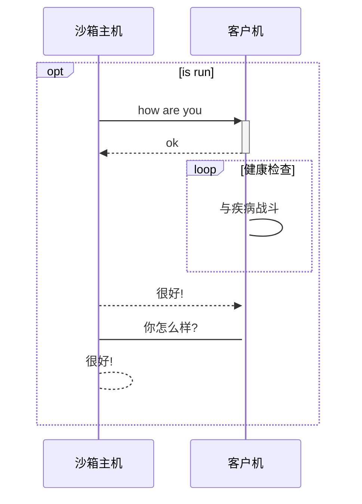

# 云沙箱（恶意软件检测平台）

**资料：**

cuckoo 使用手册 https://zhuanlan.zhihu.com/p/43410960

Cuckooml-blog https://honeynet.github.io/cuckooml/

pycharm和Github多人协作教程 https://blog.csdn.net/qq_34484082/article/details/89525865

在 Pycharm 中玩转 GitHub https://zhuanlan.zhihu.com/p/145649307

#### **学习内容：**

+ 学习内容
  - [ ] Yara规则、ssdeep
  - [ ] DLL注入、动态信息提取原理
  - [ ] 历届网络技术挑战赛调研

+ 设计文档
  + [ ] 参考文献记录（设计依据）
  + [ ] 国内沙箱深度调研
  + [ ] 图标+起名
+ 家族签名模块
  - [x] cuckoo 社区**签名库** https://github.com/cuckoosandbox/community
  - [x] https://www.secpulse.com/archives/75180.html
  - [ ] 添加挖矿+使用自定义签名

+ 机器学习模块

  - [ ] 数据集：kaggle microsoft 10000个软件、挖矿软件 6000个；
  - [ ] 报告显示内容：模型检测图展示、使用特征展示、预测威胁得分
  - [ ] 静态检测引擎: ember、string、Op-code、灰度图、malconv
  - [ ] 动态检测引擎：API调用序列

  - [ ] 

+ 后期需求
  + [ ] 环境打包，Docker\shells安装
  + [ ] 冗余文件删除
  + [ ] blog 说明编写
  + [ ] 虚拟机管理：libvirt+高并发虚拟机
  + [ ] 虚拟机分布式优化
  + [ ] 沙箱内存管理：MemScrimper: Time- and Space-Efficient Storage of *Malware* Sandbox Memory Dumps （2018 DIVMA）



### 一、需求现状

#### 1.1 恶意软件发展现状

**恶意软件**："恶意设计造成计算机，服务器，客户端，或计算机网络损害的软件。" ——维基百科

国际知名安全评测组织AV-TEST最新报告指出：

- 到2021年，已知的恶意软件数量已经接近12亿
- Windows恶意软件占比最多达83.45%

#### 1.2 用于恶意软件分析的沙箱

**沙箱**：“在计算机安全领域，沙盒是一种用于分离正在运行的程序的安全机制。它通常用于执行未经验证的代码，或不受信任的——来自未经验证的第三方、软件供应商、不受信任的用户和网站的——程序。”  ——维基百科

目标：在一个孤立的环境中运行一个不受信任的未知应用程序或文件，并获取它的行为信息（网络行为等）。

实现基础：针对恶意软件的<u>动态分析</u>方法。（扩展：结合<u>静态分析二进制文件</u>以及<u>恶意流量检测</u>的方法）
cjajncanj
###　二、理论大纲

#### 2.1 辅助功能模块

**定义了一些需要与每个分析过程并行执行的功能**。模块函数主要包括：

```python
from cuckoo.common.abstracts import Auxiliary

class MyAuxiliary(Auxiliary):
  
		def start(self):
		# Do something.

		def stop(self):
		# Stop the execution.
```

- start()：将在主机启动客户机并有效执行提交的恶意文件之前执行
- stop()：将在分析过程的最后以及启动处理和报告过程之前执行

##### 2.1.1 sniffer功能模块

sniffer模块负责执行tcpdump以转储沙箱样本分析过程中生成的网络流量

##### 2.2.2 mitm功能模块

mitm模块负责执行mitmdump以提供中间人代理功能

##### 2.2.3 reboot功能模块

reboot功能模块负责提供重启分析支持

#### 2.2 机器交互模块

定义了与虚拟化软件（或物理磁盘映射方案）的交互过程。设计要求包括：

```python
from cuckoo.common.abstracts import Machinery
from cuckoo.common.exceptions import CuckooMachineError

class MyMachinery(Machinery):
 		def start(self, label):
 				try:
 						revert(label)
 						start(label)
 				except SomethingBadHappens:
 						raise CuckooMachineError("oops!")

 		def stop(self, label):
 				try:
 						stop(label)
 				except SomethingBadHappens:
 						raise CuckooMachineError("oops!")
```

- 常规的start()和stop()
- initialize()：根据指定的配置信息（标签、平台、IP等）生成可用客户机的列表
- 设置执行失败的报错机制

实现基础：Libvirt——管理多个虚拟化平台或软件的API

##### 2.2.1 virtualbox

启动virtualbox虚拟机初始化相关配置

#### 2.3 文件分析模块

定义了在客户机环境中**执行并分析给定的文件**的过程。可以设置一个包含对所有类型的文件的通用处理方法的基类，然后在针对特定类型的文件进行特定操作时再继承重写。基类的模块函数主要包括：

```python
from lib.api.process import Process
from lib.common.exceptions import CuckooPackageError

class Package(object):
 		def start(self):
 				raise NotImplementedError

 		def check(self):
 				return True

 		def execute(self, path, args):
 				dll = self.options.get("dll")
 				free = self.options.get("free")
 				suspended = True
 				if free:
 						suspended = False

 				p = Process()
 				if not p.execute(path=path, args=args, suspended=suspended):
 						raise CuckooPackageError(
								 "Unable to execute the initial process, analysis aborted."
 						)

 				if not free and suspended:
 						p.inject(dll)
 						p.resume()
 						p.close()
 						return p.pid
		def finish(self):
 				if self.options.get("procmemdump"):
        		for pid in self.pids:
						p = Process(pid=pid)
						p.dump_memory()
				return True  
```

- start()：进行所有初始化操作，包括运行恶意软件进程、启动其他应用程序、拍摄内存快照等。
- check()：执行任何类型的重复操作（每秒），可用于分析终止条件的触发机制。
- execute()：封装恶意软件执行和DLL注入两个操作。
- finish()：在完成分析并关闭客户机之前执行，用于转储所有受监控进程的进程内存。

##### 2.3.1 Windows分析模块

+ exe Package

以下作为一个例子，我们将看一看用于分析通用Windows可执行文件的默认包：

```python
 from lib.common.abstracts import Package

 class Exe(Package):
 		"""EXE analysis package."""

 		def start(self, path):
 				args = self.options.get("arguments")
 				return self.execute(path, args)
```

+ doc Package
+ pdf Package
+ 等等

##### ~~2.3.2 Linux分析模块~~

##### ~~2.3.3 Android分析模块~~

#### 2.4 结果处理模块

定义了**处理生成的原始分析结果**的方法，并将一些信息附加到一个全局容器中，之后该容器将由签名和报告生成模块使用。模块内的处理方法包括：

```python
from cuckoo.common.abstracts import Processing

class MyModule(Processing):

 		def run(self):
 				self.key = "key"
 				data = do_something()
 				return data
```

+ run()：***self.key*** 该属性定义要用作返回 ***data*** 的子容器的名称。
+ 将 ***data*** 附加到全局容器中（列表、字典、字符串等）。

##### 2.4.1 Analysisinfo

生成当前分析的一些基本信息，例如时间戳、布谷鸟的版本等。

##### 2.4.2 DynamicAnalysis

对恶意软件进行动态分析，包括解析原始行为日志，执行内存转储的分析，提取完整的行为信息（如进程痕迹、行为摘要和进程树等）。

##### 2.4.3 StaticAnalysis

对恶意软件进行静态分析，包括从二进制文件中提取字符串，分析文件固有信息（如哈希值等）

##### 2.4.4 NetworkAnalysis

对恶意软件产生的流量（PCAP文件）进行解析，提取网络信息（如DNS流量、域名、IP、HTTP请求等）

##### 2.4.5 Memory

在完整内存转储上执行波动性

#### 2.5 家族签名模块

**定义了一些特定的“签名”，用于表示特定的恶意行为模式或特征指标**，一定程度上实现特定的恶意软件家族的类别划分，并将一些信息附加到一个全局容器中。模块内的组成元素包括：

```python
from cuckoo.common.abstracts import Signature

class CreatesExe(Signature):
 		name = "creates_exe"
		description = "Creates a Windows executable on the filesystem"
 		severity = 2
 		categories = ["generic"]
 		authors = ["Cuckoo Developers"]
 		minimum = "2.0"
 
		def on_complete(self):
 				return self.check_file(pattern=".*\\.exe$", regex=True)
```

- 初始签名属性，包括签名标记、描述、关联事件类型及威胁等级等
- call()：签名匹配时执行的回调函数

```css
"signatures": [
		{
				"severity": 2,
				"description": "Creates a Windows executable on the filesystem",
				"alert": false,
				"references": [],
				"data": [
						{
								"file_name": "C:\\d.exe"
						}
				],
				"name": "creates_exe"
		}
]
```

#### 2.6 机器学习模块

##### 2.6.1 恶意软件检测模块

**定义一些基于机器学习的Windows恶意软件检测模型（其他文件检测模型后续添加），得到检测恶意软件，并将一些信息附加到一个全局容器中**

```python
from cuckoo.common.detection import Detection

class MyDetection(Detection):
 		
    def extract_features(self)
    		
    def fit(self, X, y):
      
 		def predict(self, Y)
      	return predict
```

+ extract_features()：数据预处理
+ fit()：模型训练
+ predict()：预测目标值

- [ ] 

- [x] 基于字符串序列 ***Malware Detection by Eating a Whole EXE***

- [x] 基于恶意软件灰度图 ***Malware Images: Visualization and Automatic Classification***

- [x] 基于字节直方图、字节熵直方图、PE静态特征 

  ***EMBER-An Open Dataset for Training Static PE Malware Machine Learning Models***

- [x] 基于N_gram的字符串

- [x] 基于Opcode操作码

- [x] 基于动态API调用序列

- [ ] 等等（可选特征+可选算法的自定义模型）

##### ~~2.6.2 恶意软件聚类模块~~

~~**定义一些基于机器学习的恶意软件聚类模型，进行相似度分析**~~

#### 2.7 报告生成模块

在结果处理模块、家族签名模块、机器学习模块处理之后。**定义了恶意软件分析报告生成的不同格式。**

将结果转化为json格式：

```python
import os
import json
import codecs

from cuckoo.common.abstracts import Report
from cuckoo.common.exceptions import CuckooReportError

class JsonDump(Report):
 		"""Saves analysis results in JSON format."""
 		
    def run(self, results):
				"""Writes report.
				@param results: Cuckoo results dict.
				@raise CuckooReportError: if fails to write report.
				"""
				try:
						report = codecs.open(os.path.join(self.reports_path, "report.json"), "w",
˓→"utf-8")
						json.dump(results, report, sort_keys=False, indent=4)
						report.close()
				except (UnicodeError, TypeError, IOError) as e:
						raise CuckooReportError("Failed to generate JSON report: %s" % e)
```

#### 2.8 用户交互模块

为用户提供了上传待检测的恶意样本或URL的平台，并能够为其展示包含了目标样本或URL的详细分析信息的检测报告。模块界面示意图如下：

##### 2.8.1 数据提交功能


##### 2.8.2 数据结果展示功能


##### 2.8.3 历史结果查看功能


### 三、功能设计清单

#### 3.1 核心功能

实现一个**恶意软件分析系统**，在系统环境内可以自动地分析和检测文件，并收集全面的分析结果。

#### 3.2 文件对象

- 通用Windows可执行文件
- DLL文件
- PDF文档
- Microsoft Office文档
- URL和HTML文件
- PHP脚本
- CPL文件
- Visual  Basic（VB）脚本
- ZIP文件
- Java JAR
- Python文件
- 其他类型文件（待补充）

#### 3.3 具体功能

##### 3.3.1 文件信息

+ 文件静态信息

- 跟踪恶意软件生成的所有进程执行的调用
- 获取恶意软件在执行过程中创建、删除和下载的文件
- 获取恶意软件进程的内存转储信息
- 跟踪恶意软件进程产生的网络流量（PCAP格式）
- 保留恶意软件执行过程的截图
- 获取机器的完全内存转储信息
- 其他功能（待补充）

##### 3.3.2 检测信息

+ 静态分析模型检测结果
+ 动态分析模型检测结果
+ ~~家族聚类模型结果（目前有模型算法、没数据）~~

### 四、系统结构框架图

#### 4.1 核心组成部分

- 主机（一台）：系统的核心服务器端，运行着云沙箱的核心组件，负责恶意软件分析任务的启动和分析结果报告的生成，同时负责管理多个客户机。

- 客户机（若干）：多个独立的隔离环境（即多台虚拟机），负责提供虚拟环境供恶意软件样本运行，同时检测目标样本的运行情况，并将检测到的数据反馈给主机。

#### 4.2 技术架构图


主机和客户机之间通过虚拟网络连接，多个客户机与主机共同组成一个局域网。

### 五、运行部署环境设计

关键点在于**客户机环境**，目标在于创建一个能够处理所有需求的隔离环境（虚拟机），并尽可能将其实例化。具体的设计内容包括：

- 客户机（Ubuntu 16.04)
- 虚拟机（windows XP等）

### 六、技术重难点

#### 6.1 核心问题

- 分析的系统文件类型种类很多、检测方式不统一？

  - 目前确定先完成windows系统、后续增加linux、Android系统。

- 反沙箱技术

  - yara规则标记

  


