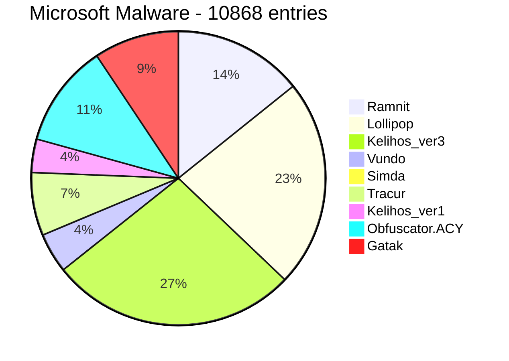
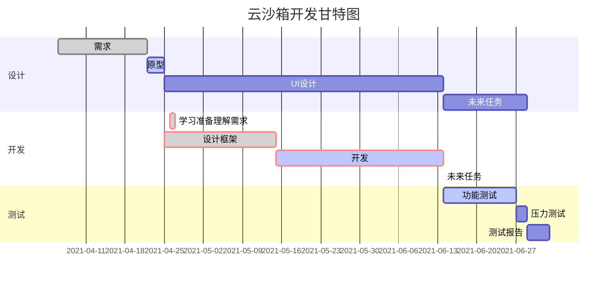

# 设计文档

## 一、背景介绍

### 1.1 恶意软件

恶意软件意软件是指为达成某种恶意目的而编写的可执行程序，包括病毒、蠕虫和特洛伊木马。其中勒索软件给社会造成了严重影响，勒索软件主要采用邮件钓鱼、账号爆破和漏洞利用等方式攻击企业、政府和教育等中大型政企机构，从中牟取暴利。同时，恶意软件的数量也在逐年增加，如2020年，安全社区( https://www.av-test.org/en/statistics/malware) 已知的恶意可执行软件的数量已经超过11亿，而且这个数字可能还会持续增长。造成恶意软件数量增加的原因有以下三点：第一，随着网络技术的高速发展，恶意软件的传播途径也越来越多，如下载盗版电影、搜索热话题和安装来路不明的防病毒软件等。第二，自动化恶意软件生成工具的滥用导致恶意软件变体数量的增多。第三，恶意软件犯罪团伙逐渐形成规模化的商业运行，形成新的恶意软件合作生态。

 目前恶意软件检测方法对比如下：


### 1.2 恶意软件造成的财富损失

尽管勒索软件约占恶意软件总事件的3%,，但相比其他恶意软件破坏力更大，一旦遭遇勒索，企业将面临业务中断、高额赎金的风险、高额赎金的风险。根据 Coveware 的数据显示，与 2019 年相比，2020 年第二季度的赎金要求同比增加了 4 倍。


### 1.3 沙箱

#### 1.3.1 沙箱的介绍     

沙箱，英文**sandbox**。在计算机领域指一种虚拟技术，且多用于计算机安全技术。安全软件可以先让它在沙盒中运行。沙箱中的所有改动对操作系统不会造成任何损失。通常这种技术被计算机技术人员广泛使用，尤其是计算机反病毒行业，沙箱是一个观察计算机病毒的重要环境。影子系统即是利用了这种技术的软件之一。沙箱早期主要用于测试可疑软件等，比如黑客们为了试用某种病毒或者不安全产品，往往可以将它们在沙箱环境中运行。经典的沙箱系统的实现途径一般是通过拦截系统调用，监视程序行为，然后依据用户定义的策略来控制和限制程序对计算机资源的使用，比如改写注册表，读写磁盘等。

#### 1.3.2 沙箱的工作原理

沙箱的工作原理为通过重定向技术，把程序生成和修改的文件，定向到本身的文件夹中。这也包括数据的变更，包括注册表和一些系统的核心数据。通过加载自身的驱动来保护底层数据，属于驱动级别的保护。如果我们用沙箱来测试病毒的，在里面运行病毒可以说也是安全操作。所以，绝大多数的病毒软件都有沙箱的功能。

### 1.4 沙箱深度调研对

国内外基于机器学习安全产品现在如下

## 二、内容设计

### 2.1 核心组成部分

- 主机（一台）：系统的核心服务器端，运行着云沙箱的核心组件，负责恶意软件分析任务的启动和分析结果报告的生成，同时负责管理多个客户机。

- 客户机（若干）：多个独立的隔离环境（即多台虚拟机），负责提供虚拟环境供恶意软件样本运行，同时检测目标样本的运行情况，并将检测到的数据反馈给主机。

### 2.2 系统架构图

主机和客户机之间通过虚拟网络连接，多个客户机与主机共同组成一个局域网

### 2.3 系统部署环境

<div class="center">

| 名称       | 版本                  |
| ---------- | --------------------- |
| **主机**   | 16.04                 |
| **客户机** | Windows XP（32-bits） |
| **Django** | 1.8.4                 |
| **Python** | 2.7                   |
| ...        | ...                   |

</div>


### 2.4 工作目录CWD（Contain Working Directory)

**工作目录**存放程序所有使用的文件（代理、分析脚本、配置文件、日志、注入程序、签名、结果目录、Web设置、白名单、Yara规则和MongoDB数据库等），其CWD内容如下：

```json
- agent
  - agent.py 代理文件
- analyzer
	- windows windows文件分析脚本
	- android （可扩展）
	- linux （可扩展）
- conf
  - auxiliary 辅助模块配置文件
  - cuckoo.conf 沙箱主机配置文件
	- processing 结果处理模块的配置文件
	- models 机器学习模块的配置文件
	- reporting 报告生成模块的配置文件
	- virualbox 虚拟机管理软件的配置模块
- log 日志
- monitor 进程注入的DLL
- signatures 签名
- models 模型
	- 静态特征
		- ember.model
		- malconv.model
	- 动态特征
		- api_gram.model
- storage
	- analyses
		- task_id 结果目录
			- 结果容器
			- report
- web 前端配置文件
- whitelist 白名单
- yara yara规则
- cuckoo.db 数据库
```

### 2.5 功能列表

#### **2.5.1  文件对象**

<table align="center">
	<tr>
	    <th>客户机环境</th>
	    <th>文件对象</th>
	</tr>
	<tr>
	    <th rowspan="7">Windows</th>
	    <td>通用Windows可执行文件</td>
	</tr>
	<tr>
	    <td>DLL文件</td>
	</tr>
	<tr>
        <td>PDF文档</td>
	</tr>
	<tr>
	    <td>Microsoft Office文档</td>
	</tr>
	<tr>
        <td>ZIP文件</td>
	</tr>
	<tr>
	    <td>Java JAR文件</td>
	</tr>
	<tr>
	    <td>Python文件</td>
	</tr>
  <tr>
    <th>Linux(后续工作)</th>
    <td>基于Shell的通用可执行文件</td>
</tr>
<tr>
    <th>Android(后续工作)</th>
    <td>APK文件</td>
</tr>

#### **2.5.2  数据集描述**

**1）[Microsoft Malware - Kaggle](https://www.kaggle.com/c/malware-classification/data)**

- **数据说明**：本数据集提供了一组已知的恶意代码文件，它们代表9个不同的家族。每个恶意代码文件都有一个 Id（唯一标识文件的散列值）和一个类别标记（恶意代码可能属于的9个家族之一）。
- **数据类型**：对于每个恶意代码文件，分别存在两种格式
  - 原始数据文件（.bytes），包含文件二进制内容的十六进制表示，没有PE头（以确保不可执行）
  - 元数据清单日志（.asm），包含从二进制文件中提取的各种元数据信息，如函数调用、字符串等
- **数据分布**



**2）[Mining Malware - Datacon](https://datacon.qianxin.com/opendata/maliciouscode)**

- **数据说明**：本数据集来自每天从现网捕获的大量挖矿型恶意代码和非挖矿型恶意代码，经过数据清洗、代码相似性分析等方法对样本进行处理，并已抹去样本PE结构中的MZ头、PE头、导入导出表等区域。

- **数据类型**：对于每个恶意代码，提供包含文件二进制内容的原始数据文件

- **数据分布**

  ```mermaid
  pie
  
  title Mining Malware - 6000 entries
    
  "Mining": 2000
  "Non-mining": 4000
  ```


#### **2.5.3  检测信息**

**1）辅助信息**

| 辅助模块名称 | 辅助模块功能                                          |
| ------------ | :---------------------------------------------------- |
| **sniffer**  | 负责执行tcpdump以转储沙箱样本分析过程中生成的网络流量 |

**2）结果信息**

| 处理模块名称         | 处理木模块功能                                               |
| -------------------- | ------------------------------------------------------------ |
| **Analysisinfo**     | 生成当前分析的一些基本信息，例如时间戳、沙箱的版本等         |
| **BehaviorAnalysis** | 解析原始行为日志并执行一些初始转换和解释，包括完整的流程跟踪、行为摘要和流程树 |
| **Buffer**           | 丢弃缓冲区分析                                               |
| **Debug**            | 包括错误和analysis.log由文本分析模块生成                     |
| **Dropped**          | 恶意软件丢弃文件的信息                                       |
| **FeatureAnalysis**  | 包括机器学习模块中恶意软件检测器需要的特征信息（字符串、字节熵直方图、PE静态特征、字符序列、灰度图、API调用序列等） |
| **Memory**           | 在内存上执行 Volatility 工具                                 |
| **NetworkAnalysis**  | 解析PCAP文件并提取一些网络信息，例如DNS流量、域、ip、HTTP请求、IRC和SMTP流量 |
| **Screenshots**      | 屏幕截图                                                     |
| **StaticAnalysis**   | 对文件执行一些静态分析                                       |
| **String**           | 从分析的二进制文件中提取字符串                               |
| **TargetInfo**       | 包括有关分析文件的信息，如哈希，ssdeep等                     |
| **VirusTotal**       | 搜索VirusTotal.com分析文件的防病毒签名                       |

#### **2.5.3  核心检测方法**

**1）签名检测（500+开源签名）**

| 签名名称               | 签名描述                                   |
| ---------------------- | ------------------------------------------ |
| **antidbg_windows**    | 检查是否存在来自调试器和取证工具的已知窗口 |
| **generic_metrics**    | 使用GetSystem                              |
| **modifies_wallpaper** | 尝试修改桌面墙纸                           |
| **...**                | ...                                        |

**2）Yara匹配**

| 类型          | 内容                 |
| ------------- | -------------------- |
| **braries**   | 恶意软件类yara规则   |
| **office**    | office文档类yara规则 |
| **scripts**   | scripts类yara规则    |
| **shellcode** | shellcode类yara规则  |
| **urls**      | url类yara规则        |
| **Packers**   | 加壳类yara规则       |
| **...**       | ...                  |

**3）基于机器学习的恶意软件模型**

| 名称         | 类型     | 特征                               | 算法模型             |
| ------------ | -------- | ---------------------------------- | -------------------- |
| **Malconv**  | 静态分析 | 字节序列                           | Malconv卷积神经网络  |
| **Ember**    | 静态分析 | 字节熵直方图、PE静态特征、字符序列 | LightGBM集成学习模型 |
| **API_gram** | 动态分析 | API调用序列                        | XGBoost集成学习模型  |

### 2.6 功能模块组成

| 模块名称     | 模块功能                                                     |
| ------------ | ------------------------------------------------------------ |
| **辅助功能** | 定义了一些需要与每个分析过程并行执行的功能                   |
| **机器交互** | 定义了与虚拟化软件的交互过程                                 |
| **文件分析** | 定义了在客户机环境中执行并分析给定的文件的过程               |
| **结果处理** | 定义了处理生成的原始分析结果的方法，并将一些信息附加到一个全局结果容器中 |
| **家族签名** | 定义了一些特定的“签名”，用于表示特定的恶意行为模式或特征指标 |
| **机器学习** | 定义了一些基于机器学习的恶意软件检测模型,生成检测结果        |
| **报告生成** | 定义了将全局结果容器保存格式，并存储到数据库中               |
| **用户交互** | 定义了用户的提交样本和样本报告显示形式                       |

### 2.7 沙箱运行流程


## 三、功能模块设计

### 3.1 辅助功能模块

#### 3.1.1 设计说明

​		辅助模块定义了一些需要与每个**样本分析过程中进行并行执行的辅助功能**。为用户提供记录分析样本的网络流量、中间人代理、客户端重启等辅助功能。全部辅助模块放在 **../cuckoo/auxiliary/** 目录下，全部辅助模块配置选项在 ***.CWD/conf/auxiliary.conf*** 文件下。

**1）辅助功能定义函数**

```python
class MyAuxiliary(Auxiliary):
		"""定义辅助模块"""
		def start(self):
		# 定义辅助功能

		def stop(self):
		# 定义模块关闭
```

- start()：将在主机启动客户机并有效执行提交的恶意文件之前执行
- stop()：将在分析过程的最后以及启动处理和报告过程之前执行

**2）辅助功能运行函数**

```python
class RunAuxiliary(object):
    """辅助模块管理"""
		def __init__(self, task, machine, guest_manager)：
   	# 辅助功能模块初始化
    
  	def start(self):
    # 辅助功能模块配置
  		 options = config2("auxiliary", module_name)
    def callback(self, name, *args, **kwargs):
    # 辅助功能模块加载
 		 	MyAuxiliary.start()	
  	def stop(self):
    # 辅助功能模块关闭
    	MyAuxiliary.stop()	
```

+  \__init\_\_(): 辅助功能模块初始化（任务号、虚拟机软件、客户机IP映射等）
+ start(): 根据 ***.CWD/conf/auxiliary.conf*** 下的配置选择辅助功能模块列表
+ callback(): 开启辅助功能模块列表的辅助功能
+ stop(): 关闭辅助功能模块列表的辅助功能

**3）辅助功能列表**

| 辅助模块名称 | 辅助模块功能                                          |
| ------------ | :---------------------------------------------------- |
| **sniffer**  | 负责执行tcpdump以转储沙箱样本分析过程中生成的网络流量 |
| **mitm**     | 负责执行mitmdump以提供中间人代理功能                  |
| **reboot**   | 负责提供重启分析支持                                  |

#### 3.1.2 设计流程

**1) 辅助功能模块时序图**


**2）辅助功能模块流程设计**

1. 启动沙箱主机
2. 初始化沙箱配置
3. 辅助功能模块初始化
4. 辅助功能模块加载
5. 辅助功能模块开启
6. 样本上传
7. 样本分析
8. 分析结果存储
9. 辅助功能模块存储
10. 辅助功能模块关闭

### 3.2 机器交互模块

#### 3.2.1 设计说明

​		**定义了与虚拟化软件的交互过程**，**开启虚拟机、启动任务调度、上传样本、上传分析模块和分析配置文件、在数据库中记录虚拟机的状态等**。全部机器交互模块放在 **../cuckoo/mechinery/** 目录下，我们默认使用了VirtualBox虚拟机软件。全部辅助模块配置选项在 ***.CWD/conf/virualbox.conf*** 文件下。

​		**沙箱主机**与**客户机**网络配置中使用**Host-Only**连接方式，一个恶意软件被安装配置了cuckoo的host提交到各个guest进行运行分析时，host是想要知道guest的所有流量信息的，因为绝大部分的恶意软件搞破坏都依赖网络。此时只有设置Host-Only连接，host才能截获guest与互联网之间流经的所有流量，才能更好的分析恶意软件的行为方式。

**1）机器交互定义函数**

```python
class MyMachinery(Machinery):
 		def start(self, label):
 				# 开启定义虚拟机管理软件
		def initialize(self, module_name):
      	self._initialize(module_name)
        # 初始化配置信息
 		def stop(self, label):
 				# 关闭定义虚拟机管理软件
```

- start()：开启定义虚拟机管理软件
- stop()：关闭定义虚拟机管理软件
- initialize()：根据指定的配置信息（标签、平台、IP等）生成可用客户机的列表

**2）机器交互管理函数**

```python
class AnalysisManager(threading.Thread):

    def __init__(self, task_id, error_queue):
        # 读取任务的消息、配置文件中的服务端ip和端口

    def init(self):
        # 初始化分析, 创建分析结果存储目录

    def acquire_machine(self):
        # 开启配置虚拟机
        
    def launch_analysis(self):
  			# 开启分析任务
        self.init():
        self.acquire_machine()
        # 开启虚拟机如：machinery/virtualbox.py 中 VirtualBox.start
        machinery.start(self.machine.label, self.task)

        return succeeded
```

+ \__init\_\_(): 读取任务的消息(指明分析时间、系统类型、开始时间、结束时间、指明分析状态）；配置文件中的服务端ip和端口（我这里设置的是192.168.56.1和2042）
+ init()：创建文件夹, 用于存放分析结果和样本文件，将target指向的文件存放到storage/binaries下
+ acquire_machine(): 开启配置虚拟机
+ launch_analysis(): 开启分析任务，各个模块的清理工作

**3）客户端代理函数**

Host和Client端的数据传输,客户端代理 **agent.py** 脚本在客户机运行

```python
class MiniHTTPRequestHandler(SimpleHTTPServer.SimpleHTTPRequestHandler):
  	# 用作对不同路径的不同函数处理(响应)
    server_version = "Cuckoo Agent"

    def do_GET(self):
       # 响应GET请求

    def do_POST(self):
       # 响应POST请求
    	 # host与client之间的数据传输, 格式为multipart/form-data
```

+ do_GET(): 响应GET请求
+ do_POST():
  +  响应POST请求
  + host与client之间的数据传输, 格式为multipart/form-data.可以理解key:value形式
  + 如: analysis.conf, 分析模块, 样本等，这些数据在传输的时候, 都要带有filename字段

```python
AGENT_VERSION = "0.10"
AGENT_FEATURES = [
    "execpy", "pinning", "logs", "largefile", "unicodepath",
]
 
@app.route("/")
def get_index():
  
@app.route("/environ")
def get_environ():

@app.route("/mktemp", methods=["GET", "POST"])
def do_mktemp():
    
@app.route("/mkdtemp", methods=["GET", "POST"])
def do_mkdtemp():  
    
@app.route("/extract", methods=["POST"])
def do_extract():
    
@app.route("/store", methods=["POST"])
def do_store():
  
@app.route("/execpy", methods=["POST"])
def do_execpy():
       
@app.route("/status")
def get_status():
```

+ get_index(): agent的一些基本信息

  + 浏览器输入`192.168.56.2:8000` 返回：

    ```python
    {"message": "Cuckoo Agent!", "version": "0.10", "features": ["execpy", "pinning", "logs", "largefile", "unicodepath"]}
    ```

+ get_environ(): 获取client端环境变量,以便后面后续的一些命令执行

+ do_mktemp() 和 do_mkdtemp()

  + 两个创建临时文件夹的命令: mktemp和mkdtemp. 但二者创建的位置不一样
  + mkdtemp --> 在%SYSTEMDRIVE%(C:\)下创建一个随机文件夹
  + mktemp --> 在%TEMP%(C:\Users\bill\AppData\Local\Temp)下创建一个随机文件夹

+ do_extract(): 将分析模块以zip格式压缩,发送给client端. 发送extrac命令, 将分析模块解压到上一步创建的文件夹中.

+ do_store():

  + 执行store命令, 写入analysis.conf 到 C:/tmppx7scx/analysis.conf

  | analysis.conf | 内容                                                         |
  | ------------- | ------------------------------------------------------------ |
  | **category**  | file                                                         |
  | **target**    | /tmp/cuckoo-tmp-pwnmelife/tmpZ3SA0v/maze.exe (host端的样本地址) |
  | **package**   | exe                                                          |
  | **file_type** | PE32 executable (GUI) Intel 80386, for MS Windows            |
  | **file_name** | maze.exe                                                     |
  | **clock**     | 20200620T09:28:00                                            |
  | **id**        | 1                                                            |
  | **timeout**   | 120                                                          |
  | **ip**        | 192.168.56.1                                                 |
  | **port**      | 2042                                                         |

  + 执行store命令, 写入simple.bin 到 C:\Users\bill\AppData\Local\Temp\simple.bin

+ do_execpy(): 执行分析脚本

+ get_status(): 不断获取样本分析状态

**4）客户端管理函数**

```python
class GuestManager(object):

    def __init__(self, vmid, ipaddr, platform, task_id, analysis_manager):
      	# 初始化信息

    def stop(self):
  			# 关闭客户端分析
    def upload_analyzer(self, monitor):
        # 上传分析模块
     
    def add_config(self, options):
				# 上传分析脚本

    def start_analysis(self, options, monitor):
        # 客户端开启分析
        self.upload_analyzer(monitor)

        self.add_config(options)

        # 执行store命令 --> 在系统中执行写入analysis.conf
        self.post("/store", files=files, data=data)

        # 执行execpy命令 --> 在系统中执行python analyzer.py
        self.post("/execpy", data=data)
            
        # 执行execute命令, execute(command)
        self.post("/execute", data=data)

    def wait_for_completion(self):
        # 不断获取客户端分析状态
```

+ \__init\_\_(): 初始化IP、端口号、系统、任务号、保存路径信息
+ stop(): 关闭客户端分析
+ upload_analyzer(): 
  + 分析模块的文件位于cuckoo/cuckoo/data/analyzer/(android, darwin, linux, windows)
  +  analyzer_zipfile 也会将 dumpmem.yarac 和Monitor 写入到压缩文件流中
+ add_config(): 上传分析脚本，将options中的内容传入client中, 写入到self.analyzer_path的analysis.conf中
+ start_analysis(): 客户端开启分析,client 端也开启了http server, 获取agent(配置的时候,需要在虚拟机中放置agent.py)的信息
+ wait_for_completion(): 不断获取客户端分析状态

#### 3.2.2 设计流程

**1) 机器交互模块时序图**


**2) 机器交互模块设计流程**

1. 启动沙箱主机
2. 初始化沙箱配置
3. 启动虚拟机管理软件
4. 根据指定的配置信息（标签、平台、IP等）生成可用客户机的列表
5. 创建文件夹, 用于存放分析结果和样本文件，将target指向的文件存放到storage/binaries下
6. 开启分析任务、开启客户端
7. 使用GET/index访问代理
8. 获取agent的一些基本信息
9. 使用GET/environ访问代理
10. 获取client端环境变量,以便后面后续的一些命令执行
11. 使用GET/mktemp访问代理
12. mkdtemp --> 在%SYSTEMDRIVE%(C:\)下创建一个随机文件夹
13. 使用GET/mkdtemp访问代理
14. mktemp --> 在%TEMP%(C:\Users\bill\AppData\Local\Temp)下创建一个随机文件夹
15. 使用POST/extract访问代理
16. 将分析模块以zip格式压缩,发送给client端. 发送extrac命令, 将分析模块解压到上一步创建的文件夹中.
17. 使用POST/store访问代理
18. 写入analysis.conf 到 C:/tmppx7scx/analysis.conf
19. 使用POST/store访问代理
20. 写入simple.bin 到 C:\Users\bill\AppData\Local\Temp\simple.bin
21. 使用POST/execpy访问代理
22. 执行分析脚本
23. 使用POST/status访问代理
24. 不断获取样本分析状态
25. 关闭客户端
26. 关闭虚拟机管理软件

### 3.3 文件分析模块

#### 3.3.1 设计说明

​		文件分析模块定义了分析组件在客户机环境中**执行并分析给定的文件**的过程。可以通过设置一个包含对所有类型的文件的通用处理方法的基类Package，然后使用多态的形式为不同类型的文件实现不同的启动分析方式。可供样本运行的客户机环境包括Windows、Linux、Android系统等，模块代码存放在***../cuckoo/data/analyzer/***目录下，包含所有用户指定选项的配置存储在***self.options***文件中。

**1）文件分析模块定义函数**

```python
class Package(object):
    """定义文件分析模块"""
 	def start(self):
        # 定义文件分析初始化操作
 		raise NotImplementedError

    def check(self):
        # 执行重复操作
        return True

    def execute(self, path, args):
        # 启动分析进程
        dll = self.options.get("dll")
        free = self.options.get("free")
        suspended = True
        if free:
            suspended = False
        p = Process()
        if not p.execute(path=path, args=args, suspended=suspended):
            raise CuckooPackageError(
                    "Unable to execute the initial process, analysis aborted."
            )

        if not free and suspended:
            p.inject(dll)
            p.resume()
            p.close()
            return p.pid

    def finish(self):
        # 转储进程内存
        if self.options.get("procmemdump"):
            for pid in self.pids:
                    p = Process(pid=pid)
                    p.dump_memory()
        return True
```

+ start()：进行所有初始化操作，包括运行恶意软件进程、启动其他应用程序、拍摄内存快照等。
+ check()：执行任何类型的重复操作（每秒），可用于分析终止条件的触发机制。
+ execute()：封装恶意软件执行和DLL注入两个操作。
+ finish()：在完成分析并关闭客户机之前执行，用于转储所有受监控进程的进程内存。

**2）分析进程定义函数**

以Windows环境中的分析进程为例：

> guest.py

```python
Class Process(object):
    """Windows分析进程"""
    
    def execute(self):
        # 执行样本分析
        
        # 启动inject.exe作为中间人，负责启动目标样本进程并挂起主线程
        argv = [
            inject_exe,
            "--app", path,
            "--only-start",
        ]
		subprocess_checkoutput(argv, env)
        
        # 再次启动inject.exe作为中间人，执行dll注入功能
        argv = [
            inject_exe,
            "--resume-thread",
            "--pid", "%s" % self.pid,
            "--tid", "%s" % self.tid,
        ]
        if free:
            argv.append("--free")
        else:
            argv += [
                "--apc",
                "--dll", dllpath,
            ]
        subprocess_checkoutput(argv, env)
```

**3）管道通信定义函数**

```python
Class PipeServer(threading.Thread):
    # 接收传入的管道句柄，创建新线程
    
    def run(self):
        handler.start()
```

```python
Class PipeForwarder(threading.Thread):
	# 将通过管道接收的数据发送给中心服务器
    
    def run(self):
        socket.create_connection()
        socket.sendall()
```

**4）Windows分析模块运行函数**

以分析通用Windows可执行文件的默认方法为例：

```python
class Exe(Package):
    """EXE分析包"""
	
    def start(self, path):
        args = self.options.get("arguments")
        return self.execute(path, args)
```

**5）Linux分析模块运行函数（后期扩展）**

```python
class Generic(Package):
    """基于Shell的通用执行分析包"""

    def start(self, path):
        os.chmod(path, 0o755)
        return self.execute(["sh", "-c", path])
```

**6）Android分析模块运行函数（后期扩展）**

```python
class Apk(Package):
    """APK分析包"""

    def start(self, path):
        install_sample(path)
        execute_sample(self.package, self.activity)
```

**7）分析脚本运行函数**

```python
class Analyzer(object):
    """Windows分析脚本"""
    
    def prepare(self):
        # 配置分析环境
        
    def run(self):
    		# 启动分析进程
        
        self.prepare()
        Package()
        # 根据文件类型选择对应的分析包
        package = choose_package()
        Auxiliary()
        # 启动一系列辅助分析工具
        aux.init()
        aux.start()
        # 隐藏进程
        zer0m0n.hidepid(self.pid)
        zer0m0n.hidepid(self.ppid)
        # 开始执行分析包
        package.start()
        package.execute()
```

- prepare(): 为分析进程配置环境，包括授予权限、启动管道服务器等
- run(): 启动分析进程，首先启动一系列辅助分析工具，并根据上传的文件类型选择其对应的文件包，在隐藏当前进程及其父进程后，执行分析包

**8）文件分析对象列表**

<table align="center">
	<tr>
	    <th>客户机环境</th>
	    <th>文件对象</th>
	</tr>
	<tr>
	    <th rowspan="8">Windows</th>
	    <td>通用Windows可执行文件</td>
	</tr>
	<tr>
	    <td>DLL文件</td>
	</tr>
	<tr>
        <td>PDF文档</td>
	</tr>
	<tr>
	    <td>Microsoft Office文档</td>
	</tr>
	<tr>
        <td>ZIP文件</td>
	</tr>
	<tr>
	    <td>Java JAR文件</td>
	</tr>
	<tr>
	    <td>Python文件</td>
	</tr>
	<tr>
	    <td>......</td>
	</tr>
	<tr>
	    <th>Linux</th>
	    <td>基于Shell的通用可执行文件</td>
	</tr>
	<tr>
	    <th>Android</th>
	    <td>APK文件</td>
	</tr>
</table>

#### 	3.3.2 设计流程

**1）文件分析模块时序图**


**2）文件分析模块流程设计**

1. 分析环境准备
   - 授予当前进程两个新权限，用于后续操作样本所在进程和加载驱动使用
   - 启动两个管道服务器与目标样本进程交互，分别用于传输代码执行日志和函数调用记录日志
2. 启动一系列辅助分析工具，主要包括截屏工具、驱动加载工具等
3. 调用Package类，根据上传的文件类型选择其对应的文件包来启动分析
4. 调用驱动功能，实现对当前进程（Analyzer进程）和父进程（Agent）的隐藏，防止目标检测到沙箱的存在
5. 启动目标样本的分析进程
6. 挂起主线程
7. 输出目标样本进程pid和主线程tid，退出
8. 再次启动目标样本进程，注入monitor.dll
9. 唤醒主线程，执行样本
10. monitor_init()

   - 配置读取初始化
   - hook初始化
   - 管道初始化，连接前面Analyzer进程开启的两个管道
   - sleep初始化，针对sleep函数进行特殊处理
   - monitor模块的自我隐藏：抹去PE头数据+从PEB中的模块链表中将自己摘掉

11. process.py

    - 工具脚本，处理对象为根据不同功能分成的rst文件（file.rst、process.rst、network.rst等等）

    - 提取rst文件中所有需要HOOK的函数的信息，包括函数所在的模块名，函数名称、函数的所有参数信息、函数的返回值等
    - 将所有rst文件通过一个hooks.c的代码模板渲染出来，得到完整的hooks.c文件，该代码文件里面定义了一个全局的g_hooks的数组，来记录所有待hook的函数信息
12. monitor_hook()：安装HOOK，生成函数调用记录
13. 通过管道发送代码执行日志和函数调用记录日志
14. 通过Socket通信发送代码执行日志和函数调用记录日志到中心服务器
15. 中心服务器对文件分析结果进行各种形式的存储（分析日志、数据库、结果文件夹等），分析结果放置在***../cuckoo/storage/analyse/{task_id}***目录下，供后续结果处理模块使用

### 3.4 结果处理模块

#### 3.4.1 设计说明

​		**结果处理模块**允许自定义的方法来分析沙盒生成的原始结果，并将一些信息附加到一个**全局结果容器**中，该结果容器稍后将由**家族签名模块**、**机器学习模块**和**报告生成模块**使用。**../cuckoo/processing/目录 **中提供的所有处理模块，都属于结果处理模块。每个模块在 ***.CWD/conf/processing.conf*** 中都应该有一个专门的配置选项，供用户选择结果处理功能。

​		**结果处理模块都将被初始化和执行**，返回的数据将被附加到一个为**全局结果容器**的数据结构中。这个容器仅仅是一个大的**Python字典**，它包含了由所有按标识键分类的模块生成的抽象结果。每次分析的全局结果容器被储存在 ***.CWD/storage/analysis/task_id*** 文件夹下

**1）结果模块定义函数**

```python
class MyModule(Processing):

 		def run(self):
 				self.key = "key"
 				data = do_something()
 				return data
```

+ run()：***self.key*** 该属性定义要用作返回 ***data*** 的子容器的名称。
+ 将 ***data*** 附加到全局容器中（列表、字典、字符串等）。

**2）结果模块运行函数**

```python
class RunProcessing(object):

    def __init__(self, task):
        # 初始化信息
    def process(self, module, results):
      	# 执行一个结果处理模块
    def run(self):
        # 执行所有结果处理模块，返回全局结果容器
        # 获得 processing 功能列表
        processing_list = cuckoo.processing.plugins
        
        for module in processing_list:
            # 执行功能
            key, result = self.process(module, results)
            # If the module provided results, append it to the fat dict.
            if key and result:
                results[key] = result
        return results
```

+ \__init\_\_(): 初始化任务信息、虚拟机信息、分析结果存储路径
+ process():
  + 执行一个结果处理模块
  + 初始化对应处理功能
  + 如果在配置中禁用了处理模块，请跳过它
  + 获得分析结果存储路径
  + 执行对应处理功能
  + 返回关键字，对应处理功能结果
+ run(): 执行所有结果处理模块，返回全局结果容器

**3）结果处理功能列表**

| 处理模块名称         | 处理木模块功能                                               |
| -------------------- | ------------------------------------------------------------ |
| **Analysisinfo**     | 生成当前分析的一些基本信息，例如时间戳、沙箱的版本等         |
| **BehaviorAnalysis** | 解析原始行为日志并执行一些初始转换和解释，包括完整的流程跟踪、行为摘要和流程树 |
| **Buffer**           | 丢弃缓冲区分析                                               |
| **Debug**            | 包括错误和analysis.log由文本分析模块生成                     |
| **Dropped**          | 恶意软件丢弃文件的信息                                       |
| **FeatureAnalysis**  | 包括机器学习模块中恶意软件检测器需要的特征信息（字符串、字节熵直方图、PE静态特征、字符序列、灰度图、API调用序列等） |
| **Memory**           | 在内存上执行 Volatility 工具                                 |
| **NetworkAnalysis**  | 解析PCAP文件并提取一些网络信息，例如DNS流量、域、ip、HTTP请求、IRC和SMTP流量 |
| **Screenshots**      | 屏幕截图                                                     |
| **StaticAnalysis**   | 对文件执行一些静态分析                                       |
| **String**           | 从分析的二进制文件中提取字符串                               |
| **TargetInfo**       | 包括有关分析文件的信息，如哈希，ssdeep等                     |
| **VirusTotal**       | 搜索VirusTotal.com分析文件的防病毒签名                       |

**4）全局结果容器内容**

​		全局结果容器为python的字典格式，为**家族签名模块**、**机器学习模块**和**报告生成模块**提供信息，最后保存在 ***.CWD/storage/analyses/{task_id}/reports/report.json*** 文件中。

```json
- info
  - added/strarted/ended: 上传样本、启动分析与结束分析的时间戳
  - duration: 分析时长
  - id: ={task_id}，数据库中的任务id
  - package: 文件类型
  - machine: 样本运行环境
- signatures
	- families：恶意软件家族
	- description：签名描述
	- severity：安全等级
	- references：URL列表
  - name：签名名称
- target
  - file
    - yara: yara规则匹配
    - sha-1/sha256/sha512/md5: 文件哈希值
    - name: 文件名
    - type: 文件类型（包括运行系统与压缩加壳方式）
    - crc32: 校验码
    - path: 文件二进制形式存储路径
    - size: 文件大小
- network
  - tls/udp/http/icmp/smtp/tcp/dns: 协议解析字段
  - pcap_sha256: 流量包哈希值
- static
  - pe_imports: 导入地址表(IAT)，列出了动态链接库和它们的函数
  - imported_dll_count: DLL数量
  - pe_resources: 资源节，列出了文件中的可打印字符串、图形图像、按钮图标等信息
  - pe_sections: 文件节区信息，包括节区大小、虚拟地址、熵、加壳方式、虚拟内存等
- behavior
  - generic
    - process_path: 进程启动路径
    - process_name: 进程执行程序名
    - pid: 进程id
    - first_seen: 进程启动时间戳
    - ppid: 父进程id
  - processes
    - modules: 样本运行时调用的系统文件信息，包括被调用文件名、路径、基地址及其大小
    - time: 运行时间
  - processtree
    - children：子进程列表
- debug：analysis.log分析结果
- screenshots：指定运行截图存储路径
- strings：文件中的可打印字符串列表
```

#### 3.4.2 设计流程

**1）结果处理模块时序图**


**2）结果处理模块设计流程**

1. 启动结果处理模块

2. 初始化任务信息、虚拟机信息、分析结果存储路径
3. 获得处理功能列表
4. 执行一个结果处理功能
5. 初始化对应处理功能
6. 获得分析数据读取路径
7. 执行对应处理功能
8. 返回关键字，对应处理功能结果
9. 执行所有结果处理模块，返回全局结果容器

### 3.5 家族签名模块

#### 3.5.1 设计说明

​		**定义了一些特定的“签名”，用于表示特定的恶意行为模式或特征指标**，一定程度上实现特定的恶意软件家族的类别划分，并将一些信息附加到一个全局容器中。

​		可以创建一些定制的签名，可以针对分析结果运行这些签名，以便识别一些预定义的模式，这些模式可能表示特定的恶意行为或您感兴趣的指标。这些特征非常有用，可以为分析提供一个上下文：因为它们简化了结果的解释，也可以自动识别感兴趣的恶意软件样本。

+ 通过隔离一些独特的行为（如文件名或互斥）来识别您感兴趣的特定恶意软件系列

+ 找出恶意软件在系统上执行的有趣修改，例如安装设备驱动程序

+ 通过隔离通常由银行特洛伊木马或勒索软件执行的典型操作，识别特定的恶意软件类别

+ 将样本分类为恶意软件/未知类别，**无法识别未知的样本**

  ​	所有签名位于**../cuckoo/signatures/目录**

**1）家族签名定义函数**

**例：**检查是否有以“.exe”结尾的文件：在这种情况下，它将返回True，表示签名匹配，否则返回False

```python
class CreatesExe(Signature):
 		name = "creates_exe"
		description = "Creates a Windows executable on the filesystem"
 		severity = 2
 		categories = ["generic"]
 		authors = ["Cuckoo Developers"]
 		minimum = "2.0"
 
		def on_complete(self):
 				return self.check_file(pattern=".*\\.exe$", regex=True)
```

- 初始签名属性，包括**签名标记、描述、关联事件类型、威胁等级、家族、引用（URL）**等
- on_complete()：特征匹配签名函数
- call()：签名匹配时执行的回调函数

**2）家族签名运行函数**

```python
class RunSignatures(object):

    def __init__(self, results):
        # 初试化签名，记录标签API

    def call_signature(self, signature, handler, *args, **kwargs):   
        # 签名的包装器。这个包装器将事件产生给签名，并递归地处理匹配的签名。
      
    def process_yara_matches(self):
       
    def process_extracted(self):

    def run(self):
      
        self.process_yara_matches()
				# 遍历所有Yara匹配项
        self.process_extracted()
        		for sig in self.signatures:
                self.call_signature(sig, sig.on_extract, ExtractedMatch(item))
        # 遍历所有提取的匹配项    
        self.matched.append(signature.results())
        # 分数计算
        score += signature.severity
        # 按严重性级别对匹配的签名进行排序，并将其放入结果字典
        self.matched.sort(key=lambda key: key["severity"])
        self.results["signatures"] = self.matched
        if "info" in self.results:
            self.results["info"]["score"] = score / 5.0
```

**3）生成的签名结果**

```css
"signatures": [
		{
				"severity": 2,
				"description": "Creates a Windows executable on the filesystem",
				"alert": false,
				"references": [],
				"data": [
						{
								"file_name": "C:\\d.exe"
						}
				],
				"name": "creates_exe"
		}
]
```

**4）Yara规则**

​		[Yara](https://yara.readthedocs.io/en/stable/)是一个能够帮助恶意软件研究人员识别和分类恶意软件样本的工具，使用Yara可以基于文本或二进制模式创建恶意软件家族描述信息。每一条YARA规则都由一系列字符串和一个布尔型表达式构成，并阐述其逻辑。Yara规则可以提交给正在运行的进程，**以帮助系统识别其样本是否属于某个已进行规则描述的恶意软件家族**。Yara规则语法类似于C语言，每个规则都以关键字“**rule**”开头，后面跟着一个规则标识符。规则示例如下：

```c
rule Test : Trojan
{
    //规则描述
    meta:
        author = "Sunset"
        date = "2021-04-21"
        description = "Trojan Detection"

    //规则字符串
    strings:
        $a = {6A 40 68 00 30 00 00 6A 14 8D 91}
        $b = {8D 4D B0 2B C1 83 C0 27 99 6A 4E 59 F7 F9}
        $c = "UVODFRYSIHLNWPEJXQZAKCBGMT"

    //条件表达式
    condition:
        $a or $b or $c
}
```

根据已有恶意软件家族的专家知识，现在一般将[Yara规则](https://github.com/Yara-Rules/rules)分为11类：

1.  Antidebug_AntiVM：反调试/反沙箱类yara规则 
2.  Crypto：加密类yara规则 
3.  CVE_Rules：CVE漏洞利用类yara规则 
4.  email：恶意邮件类yara规则 
5.  Exploit-Kits：EK类yara规则 
6.  Malicious_Documents：恶意文档类yara规则 
7.  malware：恶意软件类yara规则 
8.  Mobile_Malware：移动恶意软件类yara规则 
9.  Packers：加壳类yara规则 
10.  capabilities：通用类yara规则 
11.  Webshells：Webshell类yara规则

#### 3.5.2 设计流程

**1)  家族签名模块时序图**

```mermaid
%% 时序图例子,-> 直线，-->虚线，->>实线箭头
 sequenceDiagram
  participant 沙箱主机
  participant 结果容器
  autonumber 
      %%rect rgb(121, 255, 121)
      沙箱主机->结果容器: 结果处理模块
      沙箱主机->结果容器: 启动家族签名模块
      #rect rgb(135,206,250)
      沙箱主机->>沙箱主机: 初试化所有可用签名，记录标签API
      沙箱主机->>结果容器: 遍历所有Yara规则
      结果容器-->>沙箱主机: 记录匹配的Yara规则结果
      沙箱主机->>结果容器: 遍历所有签名
      结果容器-->>沙箱主机: 记录匹配的签名结果
      沙箱主机->>沙箱主机: 签名分数计算
      沙箱主机->>沙箱主机: 按严重性级别对匹配的签名进行排序
      沙箱主机-->>结果容器: 将签名结果放入结果字典
      沙箱主机->>结果容器: ...
    #end
```

**2）家族签名模块流程设计**

1. 文件分析模块
2. 结果处理模块
3. 启动家族签名模块
4. 初试化所有可用签名，记录标签API
5. 遍历所有匹配的Yara规则
6. 遍历所匹配的签名
7. 分数计算
8. 按严重性级别对匹配的签名进行排序
9. 将签名结果放入结果字典

### 3.6 机器学习模块

#### 3.6.1 设计说明

**定义一些基于机器学习的Windows恶意软件检测模型（其他文件检测模型后续添加），得到检测恶意软件，并将一些信息附加到一个全局容器中**

**1) 检测模型定义函数 **

**补充：**

```python
class Detection(object):
  #特征提取方法、模型、预测结果feature
cuckoo.common.exceptions import CuckooDetectionError

```


```python
class MyDetection(Detection):
 		
    def extract_features(self)
    		# 数据预处理
    def fit(self, X, y):
      	# 模型训练
 		def predict(self, Y)
    		# 预测目标值
      	return predict
```

+ extract_features()：数据预处理
+ fit()：模型训练
+ predict()：预测目标值

**2）检测模型运行函数**

```python
class RunDetection(object):
		""" plugins.py """
    def __init__(self, task):
        # 初始化模型信息
    def process(self, module, results):
      	# 执行一个检测模块
    def run(self):
        # 执行所有结果检测模块，返回全局结果容器
        # 获得 detection 功能列表
        detection_list = cuckoo.detection.plugins
        
        for module in detection_list:
            # 执行功能
            model_name,predict = self.process(module, results)
            if model_name and result:
                results[model_name] = result
        return results
```

+ \__init\_\_(): 初始化检测模型
+ process():
  + 执行一个检测模块
  + 初始化对应检测功能
  + 如果在配置中禁用了检测模块，请跳过它
  + 读取分析数据路径
  + 加载预训练检测模型
  + 特征工程
  + 返回关键字，预测结果
+ run(): 执行所有检测模块，返回全局结果容器

**3）检测模型列表**

| 名称         | 类型     | 特征                               | 算法模型             |
| ------------ | -------- | ---------------------------------- | -------------------- |
| **Malconv**  | 静态分析 | 字节序列                           | Malconv卷积神经网络  |
| **Ember**    | 静态分析 | 字节熵直方图、PE静态特征、字符序列 | LightGBM集成学习模型 |
| **API_gram** | 动态分析 | API调用序列                        | XGBoost集成学习模型  |

#### 3.6.2 设计流程

**1）模型检测模块时序图**


**2）模型检测模块设计流程**

1. 启动机器学习模块
2. 初始化检测模型
3. 获得检测模型功能列表
4. 执行一个检测模块
5. 初始化对应检测功能
6. 如果在配置中禁用了检测模块，请跳过它
7. 读取分析数据路径
8. 加载预训练检测模型
9. 特征工程
10. 返回关键字，对应预测结果
11. 执行所有检测模块
12. 保存到全局结果容器
13. 机器学习模块结束

### 3.7 报告生成模块

#### 3.7.1 设计说明

​		在结果处理模块、家族签名模块、机器学习模块处理之后，**定义了恶意软件分析报告生成的不同格式**，将全局结果容器转化为json，将分析目录保存到非关系数据库 **(MongoDB)** 中。**../cuckoo/reporting/目录 **中提供的所有处理模块，都属于结果处理模块。每个模块在 ***.CWD/conf/reporting.conf*** 中都应该有一个专门的配置选项，供用户选择结果处理功能。

**1）JsonDump函数**

将全局结果容器转化为Json

```python
class JsonDump(Report):

    def erase_calls(self, results):
        # 通过将调用替换为空列表，暂时从报表中删除
        
    def run(self, results)
        # 将report.json写入report文件夹  
```

+ erase_calls(): 通过将调用替换为空列表，暂时从报表中删除
+ run(): 将report.json写入report文件夹

**2)  MongoDB存储函数**

```python
class MongoDB(Report):

    @classmethod
    def init_once(cls):
      	# 初始化mongo数据库

    def store_file(self, file_obj, filename=""):
        # 存储成 GridFS 文件格式.
 
    def run(self, results):
        # 创建词典的副本。这样做是为了不修改原始字典，并可能损害以下报告模块
        # 依次读取结果容器字段，并保存
        self.db.analysis.save(report)
```

+ init_once(): 初始化mongo数据库
+ store_file(): 储成 GridFS 文件格式
+ run():
  + 创建词典的副本。这样做是为了不修改原始字典，并可能损害以下报告模块
  + 依次读取结果容器字段，并保存

**3）报告生成运行函数**

```python
class RunReporting(object):

    def __init__(self, task, results):
      	# 初始化 任务、结果容器、任务目录
        
    def process(self, module):
       	# 执行一个生成功能模块
        # 初始化生成功能模块
        # 获得分析任务目录
    		# 执行对应处理功能
        current.run(self.results)
    
    def run(self):
        #依次执行report模块jsondump,mongodb
        reporting_list = cuckoo.reporting.plugins
        
        for module in reporting_list:
            self.process(module)
```

#### 3.7.2 设计流程

**1）报告生成模块时序图**


**2）报告生成模块设计流程**

1. 启动报告生成模块

2. 初始化 任务、结果容器、任务目录
3. 获得报告生成功能列表（jsondump,mongodb）
4. 执行一个jsondump生成功能
5. 初始化对应生成功能
6. 通过将调用替换为空列表，暂时从报表中删除
7. 将report.json写入report文件夹
8. 执行一个mongodb生成功能
9. 初始化对应生成功能
10. 创建词典的副本
11. 依次读取结果容器字段
12. 保存到数据库
13. 报告生成模块结束

### 3.8 用户交互模块

#### 3.8.1 设计说明

**1）前端框架Django**

​	  前端基于Python的Django框架开发，Django是一个开源的Web应用框架，采用MTV的框架模式：Model(模型), Template(模板), Views(视图)

| 模块     | 功能                                                         |
| -------- | ------------------------------------------------------------ |
| Model    | 数据存取层，处理和数据相关的所有事物                         |
| Template | 表现层，处理与表现相关的决定                                 |
| Views    | 业务逻辑层，存取模型以及调取恰当的模板，是模板和模型之间的桥梁 |

		

**2）Django的一些特性：**

| 特性     | 内容                                                         |
| -------- | ------------------------------------------------------------ |
| URL设计  | 可以设计任意的URL，而且还支持使用正则表达式匹配              |
| 模板系统 | 提供可扩展的模板语言，并且模板之间具有继承性                 |
| Nginx    | Nginx是一款轻量级的Web服务器，占用内存少，并发性强           |
| WSGI     | 是一种为Python语言定义的Web服务器和Web应用程序或框架之间的通用的接口协议 |

**3）WSGI的三级架构：**


**4）项目配置说明**

​		项目应用路径为***../cuckoo/web***,项目总体设置：cuckoo/web/web/setting.py文件中，包含了整个应用的配置信息，包括数据库连接、静态资源和url的路径定义、中间件和cookie的配置、模板文件的配置等

```python
mongo.connect()
DATABASES = {}
	#数据库连接
    
STATIC_URL = "/static/"
STATICFILES_DIRS = (
    ...#添加静态资源路径
)

SECURE_PROXY_SSL_HEADER = ("HTTP_X_FORWARDED_PROTO", "https")
	#配置https
    
SESSION_ENGINE = "django.contrib.sessions.backends.signed_cookies"
SESSION_COOKIE_HTTPONLY = True
	#配置cookie
    
STATICFILES_FINDERS = (
	...#finder函数用来寻找静态文件
)

MIDDLEWARE_CLASSES = (
	...#配置中间件
)

ROOT_URLCONF = "web.urls"
	#配置路由路径
    
TEMPLATES = [
	...#配置模板文件路径
]

WSGI_APPLICATION = "web.wsgi.application"
	#注册WSGI服务
    
INSTALLED_APPS = (
	...#注册应用
)
```

**项目url配置：**cuckoo/web/web/urls.py文件中配置了视图类views绑定页面的url

```python
urlpatterns = [
	...#自定义URL绑定视图函数
]

handler404 = web.errors.handler404
handler500 = web.errors.handler500
	#错误页面绑定自定义视图
```

**数据库配置：**前端数据库使用非关系型数据库MongoDB.数据库配置信息：/cuckoo/common/config.py

```python
"mongodb": {
		"enabled": Boolean(False),
		"host": String("127.0.0.1"),
		"port": Int(27017),
		"db": String("cuckoo"),
		"store_memdump": Boolean(True),
		"paginate": Int(100),
		"username": String(),
		"password": String(),
},
```

在Django前端框架中配置并连接数据库：cuckoo/web/web/setting.py

```python
mongo.connect()
```

数据库函数定义在cuckoo/common/mongo.py

```python
class Mongo(object):
    def init(self):
		#初始化
    def drop(self):
		#删除数据库表
    def close(self):
		#关闭数据库链接
    def connect(self):
    #连接数据库
```

**API接口：**获取数据库Analysis表的数据的API接口定义在cuckoo/web/controllers/analysis/api.py

```python
db = Database()
	#数据库连接
	
class AnalysisApi(object):
	def tasks_list(request, body):
        #获取任务列表
    def task_info(request, task_id):
        #获取指定任务信息
	def task_delete(request, task_id):
        #删除指定任务
    def task_screenshots(request, task_id, screenshot=None):
        #获取指定任务截图
    def tasks_stats(request, body):
        #返回任务状态
    def tasks_recent(request, body):
        #返回最近任务
    ...
```

#### 3.8.2 设计流程

**1) 前端样式设计**

**首页：**首页包含系统名称以及LOGO（待定），报告搜索框，待测文件、URL上传模块，以及查看所有报告模块。


**分析报告页面：**分析报告页面是已检测文件列表，包括文件名称、文件类型、系统环境、上传时间、威胁等级等信息。


**报告详情页面：**报告详情页面是单个检测文件的详细检测结果，包含文件基本信息、静态特征信息、动态特征信息、危险度评分、运行截图等。


### 3.9 功能全景图


## 四、 后续拓展工作

### 4.1  Linux、Android 恶意软件检测

### 4.2  恶意软件家族聚类\相似度分析

+ 聚类恶意软件样本之间的相似性

+ https://github.com/honeynet/cuckooml

### 4.3  优化虚拟机架构

+ Libvirt——管理多个虚拟化平台

## 五、当前工作进度

### 5.1 配置开发环境

+ **Ubuntu + Pycharm + 同步 Github 仓库**


### 5.2 Github 仓库多人协作

+ https://github.com/PowerLZY/cuckoo-ml


## 六、后续工作安排



## 七、遇到问题

+ 数据集良性样本？

  + 爬取PE商店  http://www.portablefreeware.com/  没有找到好的网站
  + 收集系统文件
  + [label-virusshare打标签](https://github.com/seymour1/label-virusshare)

+ 学习方向？向其他领域扩展？

  
