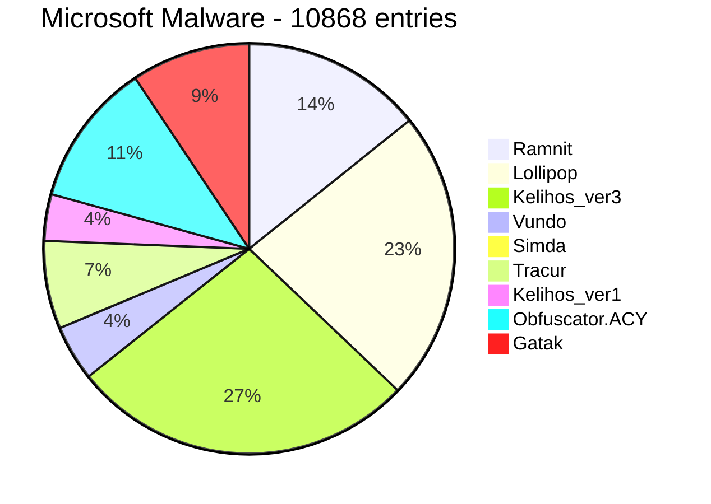

# 说明

## 1.1 背景介绍
### 1.1.2 恶意软件

恶意软件意软件是指为达成某种恶意目的而编写的可执行程序，包括病毒、蠕虫和特洛伊木马。其中勒索软件给社会造成了严重影响，勒索软件主要采用邮件钓鱼、账号爆破和漏洞利用等方式攻击企业、政府和教育等中大型政企机构，从中牟取暴利。同时，恶意软件的数量也在逐年增加，如2020年，安全社区( https://www.av-test.org/en/statistics/malware) 已知的恶意可执行软件的数量已经超过11亿，而且这个数字可能还会持续增长。造成恶意软件数量增加的原因有以下三点：第一，随着网络技术的高速发展，恶意软件的传播途径也越来越多，如下载盗版电影、搜索热话题和安装来路不明的防病毒软件等。第二，自动化恶意软件生成工具的滥用导致恶意软件变体数量的增多。第三，恶意软件犯罪团伙逐渐形成规模化的商业运行，形成新的恶意软件合作生态。

 目前恶意软件检测方法对比如下：
 
{:align="center" width="400px" height="300px"}

### 1.1.2 恶意软件造成的财富损失

尽管勒索软件约占恶意软件总事件的3%,，但相比其他恶意软件破坏力更大，一旦遭遇勒索，企业将面临业务中断、高额赎金的风险、高额赎金的风险。根据 Coveware 的数据显示，与 2019 年相比，2020 年第二季度的赎金要求同比增加了 4 倍。

{:align="center" width="400px" height="300px"}


### 1.1.3 沙箱

#### 沙箱的介绍     

沙箱，英文**sandbox**。在计算机领域指一种虚拟技术，且多用于计算机安全技术。安全软件可以先让它在沙盒中运行。沙箱中的所有改动对操作系统不会造成任何损失。通常这种技术被计算机技术人员广泛使用，尤其是计算机反病毒行业，沙箱是一个观察计算机病毒的重要环境。影子系统即是利用了这种技术的软件之一。沙箱早期主要用于测试可疑软件等，比如黑客们为了试用某种病毒或者不安全产品，往往可以将它们在沙箱环境中运行。经典的沙箱系统的实现途径一般是通过拦截系统调用，监视程序行为，然后依据用户定义的策略来控制和限制程序对计算机资源的使用，比如改写注册表，读写磁盘等。

#### 沙箱的工作原理

沙箱的工作原理为通过重定向技术，把程序生成和修改的文件，定向到本身的文件夹中。这也包括数据的变更，包括注册表和一些系统的核心数据。通过加载自身的驱动来保护底层数据，属于驱动级别的保护。如果我们用沙箱来测试病毒的，在里面运行病毒可以说也是安全操作。所以，绝大多数的病毒软件都有沙箱的功能。

### 1.1.4 沙箱深度调研对

国内外基于机器学习安全产品现在如下

## 1.2 内容设计

### 1.2.1 核心组成部分

- 主机（一台）：系统的核心服务器端，运行着云沙箱的核心组件，负责恶意软件分析任务的启动和分析结果报告的生成，同时负责管理多个客户机。

- 客户机（若干）：多个独立的隔离环境（即多台虚拟机），负责提供虚拟环境供恶意软件样本运行，同时检测目标样本的运行情况，并将检测到的数据反馈给主机。

### 1.2.2 系统架构图

主机和客户机之间通过虚拟网络连接，多个客户机与主机共同组成一个局域网

### 1.2.3 系统部署环境


| 名称       | 版本                  |
| ---------- | --------------------- |
| **主机**   | 16.04                 |
| **客户机** | Windows XP（32-bits） |
| **Django** | 1.8.4                 |
| **Python** | 2.7                   |
| ...        | ...                   |


### 1.2.4 工作目录CWD（Contain Working Directory)

**工作目录**存放程序所有使用的文件（代理、分析脚本、配置文件、日志、注入程序、签名、结果目录、Web设置、白名单、Yara规则和MongoDB数据库等），其CWD内容如下：

	- agent
	  - agent.py 代理文件
	- analyzer
		- windows windows文件分析脚本
		- android （可扩展）
		- linux （可扩展）
	- conf
	  - auxiliary 辅助模块配置文件
	  - cuckoo.conf 沙箱主机配置文件
		- processing 结果处理模块的配置文件
		- models 机器学习模块的配置文件
		- reporting 报告生成模块的配置文件
		- virualbox 虚拟机管理软件的配置模块
	- log 日志
	- monitor 进程注入的DLL
	- signatures 签名
	- models 模型
		- 静态特征
			- ember.model
			- malconv.model
		- 动态特征
			- api_gram.model
	- storage
		- analyses
			- task_id 结果目录
				- 结果容器
				- report
	- web 前端配置文件
	- whitelist 白名单
	- yara yara规则
	- cuckoo.db 数据库


### 1.2.5 功能列表

#### **1.2.5.1  文件对象**


#### **1.2.5.2  数据集描述**

**1）[Microsoft Malware - Kaggle](https://www.kaggle.com/c/malware-classification/data)**

- **数据说明**：本数据集提供了一组已知的恶意代码文件，它们代表9个不同的家族。每个恶意代码文件都有一个 Id（唯一标识文件的散列值）和一个类别标记（恶意代码可能属于的9个家族之一）。
- **数据类型**：对于每个恶意代码文件，分别存在两种格式
  - 原始数据文件（.bytes），包含文件二进制内容的十六进制表示，没有PE头（以确保不可执行）
  - 元数据清单日志（.asm），包含从二进制文件中提取的各种元数据信息，如函数调用、字符串等
- **数据分布**



**2）[Mining Malware - Datacon](https://datacon.qianxin.com/opendata/maliciouscode)**

- **数据说明**：本数据集来自每天从现网捕获的大量挖矿型恶意代码和非挖矿型恶意代码，经过数据清洗、代码相似性分析等方法对样本进行处理，并已抹去样本PE结构中的MZ头、PE头、导入导出表等区域。

- **数据类型**：对于每个恶意代码，提供包含文件二进制内容的原始数据文件

- **数据分布**

  ```mermaid
  pie
  
  title Mining Malware - 6000 entries
    
  "Mining": 2000
  "Non-mining": 4000
  ```


#### **1.2.5.3  检测信息**

**1）辅助信息**

| 辅助模块名称 | 辅助模块功能                                          |
| ------------ | :---------------------------------------------------- |
| **sniffer**  | 负责执行tcpdump以转储沙箱样本分析过程中生成的网络流量 |

**2）结果信息**

| 处理模块名称         | 处理木模块功能                                               |
| -------------------- | ------------------------------------------------------------ |
| **Analysisinfo**     | 生成当前分析的一些基本信息，例如时间戳、沙箱的版本等         |
| **BehaviorAnalysis** | 解析原始行为日志并执行一些初始转换和解释，包括完整的流程跟踪、行为摘要和流程树 |
| **Buffer**           | 丢弃缓冲区分析                                               |
| **Debug**            | 包括错误和analysis.log由文本分析模块生成                     |
| **Dropped**          | 恶意软件丢弃文件的信息                                       |
| **FeatureAnalysis**  | 包括机器学习模块中恶意软件检测器需要的特征信息（字符串、字节熵直方图、PE静态特征、字符序列、灰度图、API调用序列等） |
| **Memory**           | 在内存上执行 Volatility 工具                                 |
| **NetworkAnalysis**  | 解析PCAP文件并提取一些网络信息，例如DNS流量、域、ip、HTTP请求、IRC和SMTP流量 |
| **Screenshots**      | 屏幕截图                                                     |
| **StaticAnalysis**   | 对文件执行一些静态分析                                       |
| **String**           | 从分析的二进制文件中提取字符串                               |
| **TargetInfo**       | 包括有关分析文件的信息，如哈希，ssdeep等                     |
| **VirusTotal**       | 搜索VirusTotal.com分析文件的防病毒签名                       |

#### **1.2.5.3  核心检测方法**

**1）签名检测（500+开源签名）**

| 签名名称               | 签名描述                                   |
| ---------------------- | ------------------------------------------ |
| **antidbg_windows**    | 检查是否存在来自调试器和取证工具的已知窗口 |
| **generic_metrics**    | 使用GetSystem                              |
| **modifies_wallpaper** | 尝试修改桌面墙纸                           |
| **...**                | ...                                        |

**2）Yara匹配**

| 类型          | 内容                 |
| ------------- | -------------------- |
| **braries**   | 恶意软件类yara规则   |
| **office**    | office文档类yara规则 |
| **scripts**   | scripts类yara规则    |
| **shellcode** | shellcode类yara规则  |
| **urls**      | url类yara规则        |
| **Packers**   | 加壳类yara规则       |
| **...**       | ...                  |

**3）基于机器学习的恶意软件模型**

| 名称         | 类型     | 特征                               | 算法模型             |
| ------------ | -------- | ---------------------------------- | -------------------- |
| **Malconv**  | 静态分析 | 字节序列                           | Malconv卷积神经网络  |
| **Ember**    | 静态分析 | 字节熵直方图、PE静态特征、字符序列 | LightGBM集成学习模型 |
| **API_gram** | 动态分析 | API调用序列                        | XGBoost集成学习模型  |

### 1.2.6 功能模块组成

| 模块名称     | 模块功能                                                     |
| ------------ | ------------------------------------------------------------ |
| **辅助功能** | 定义了一些需要与每个分析过程并行执行的功能                   |
| **机器交互** | 定义了与虚拟化软件的交互过程                                 |
| **文件分析** | 定义了在客户机环境中执行并分析给定的文件的过程               |
| **结果处理** | 定义了处理生成的原始分析结果的方法，并将一些信息附加到一个全局结果容器中 |
| **家族签名** | 定义了一些特定的“签名”，用于表示特定的恶意行为模式或特征指标 |
| **机器学习** | 定义了一些基于机器学习的恶意软件检测模型,生成检测结果        |
| **报告生成** | 定义了将全局结果容器保存格式，并存储到数据库中               |
| **用户交互** | 定义了用户的提交样本和样本报告显示形式                       |

### 1.2.7 沙箱运行流程


## 1.3 功能全景图
